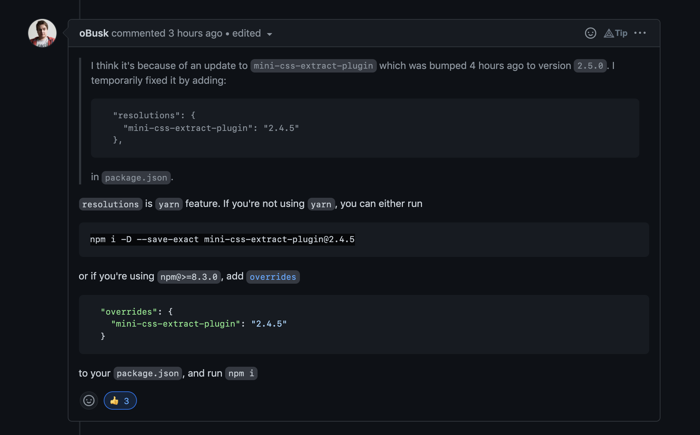

# Scrimba Frontend Career Path - (Advanced React - Module 12)

This is a solution to the [Scrimba Frontend Career Path - (Module12-AdvancedReact/React Hooks)](https://scrimba.com/learn/frontend).

## Table of contents

- [Overview](#overview)
  - [The challenge](#the-challenge)
  - [Screenshot](#screenshot)
  - [Links](#links)
- [My process](#my-process)
  - [Built with](#built-with)
  - [What I learned](#what-i-learned)
  - [Continued development](#continued-development)
  - [Useful resources](#useful-resources)
- [Author](#author)
- [Acknowledgments](#acknowledgments)

## Overview

### The challenge

Make a type fast/word count game

After this Challenge I should be able to Code/Understand:

- React Hooks
- React Custom Hooks
- useRef
- Higher Order Components
- useContext

### Screenshot

### Links

- Solution Github URL: [https://github.com/Rod-Barbosa/word-count-game](https://github.com/Rod-Barbosa/word-count-game)
- Live Site URL: [https://rodrigo-word-count-game.netlify.app/](https://rodrigo-word-count-game.netlify.app/)

## My process

### Built with

- React
- React Hooks
- React Context API

### What I learned

The real lesson came from trying to upload this app into Netlify. The usual command was failing... After lots of trial and error...
I caught a thread that went up 3 hours ago. 
Saying that web pack just recently updated.... 4 hours ago... and it was causing the build error.
So backtracking the update would "fix" it

### Continued development

Maybe a difficulty setting/timer setting would be nice. But that is for the future

### Useful resources

- [Fix Mini CSS Problem](https://github.com/facebook/create-react-app/issues/11930) - The github thread that helped me deploy it... 

## Author

- Website - [Rodrigo Portfolio](https://www.gelatodigital.com)
- Frontend Mentor - [@Rod-Barbosa](https://www.frontendmentor.io/profile/Rod-Barbosa)
- Github - [@Rod-Barbosa](https://github.com/Rod-Barbosa)

## Acknowledgments

