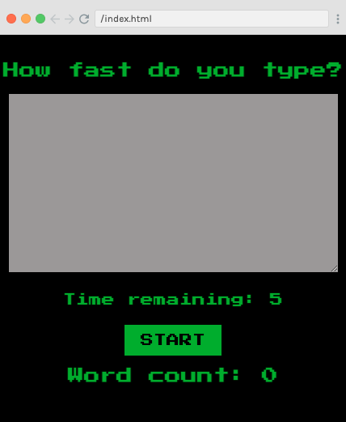
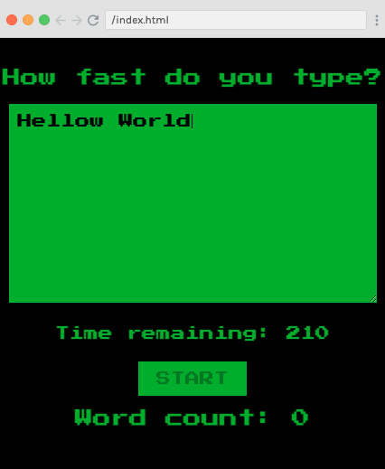
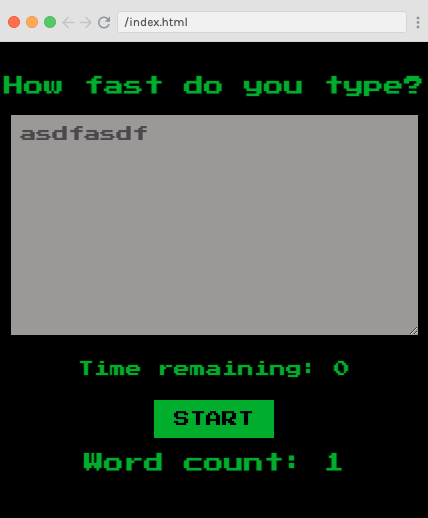

# Scrimba Frontend Career Path - (Advanced React - Module 12)

This is a solution to the [Scrimba Frontend Career Path - (Module12-AdvancedReact/React Hooks)](https://scrimba.com/learn/frontend).

## Table of contents

- [Overview](#overview)
  - [The challenge](#the-challenge)
  - [Screenshot](#screenshot)
  - [Links](#links)
- [My process](#my-process)
  - [Built with](#built-with)
  - [What I learned](#what-i-learned)
  - [Continued development](#continued-development)
  - [Useful resources](#useful-resources)
- [Author](#author)
- [Acknowledgments](#acknowledgments)

## Overview

### The challenge

Make a type fast/word count game

After this Challenge I should be able to Code/Understand:

- React Hooks
- React Custom Hooks
- useRef
- Higher Order Components
- useContext

### Screenshot

